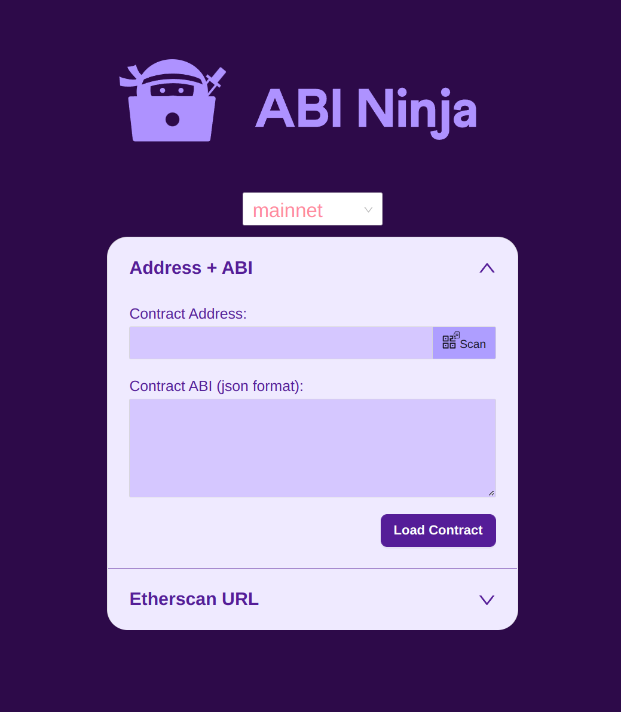

# Contract Interface Tool

Interact with any contract by providing its ABI + address, or the Etherscan URL of a verified contract.




# 🏄‍♂️ Quick Start

Prerequisites: [Node (v16 LTS)](https://nodejs.org/en/download/) plus [Yarn](https://classic.yarnpkg.com/en/docs/install/) and [Git](https://git-scm.com/downloads)

> clone/fork this repo

> install the project dependencies and start your 👷‍ Hardhat chain:

```bash
yarn install
yarn chain
```

> in a second terminal window, start your 📱 frontend:

```bash
yarn start
```

📝 Edit your frontend `App.jsx` in `packages/react-app/src`

📱 Open http://localhost:3000 to see the app
