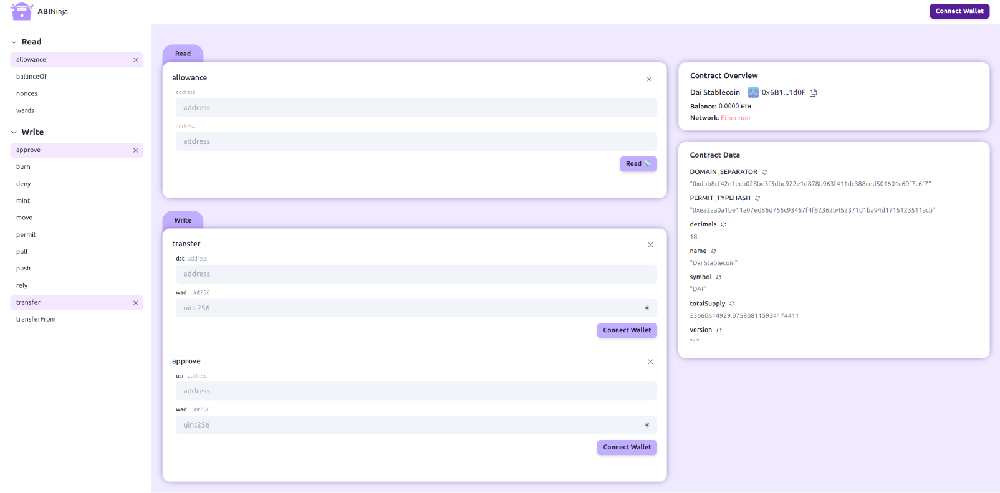

# ABI Ninja

Interact with any contract on Ethereum. You just need the Contract address (if it's verified) or its ABI + Contract address.

Built with 🏗 [Scaffold-ETH 2](https://github.com/scaffold-eth/scaffold-eth-2).




# 🏄‍♂️ Development Quick Start

Before you begin, you need to install the following tools:

- [Node (v18 LTS)](https://nodejs.org/en/download/)
- Yarn ([v1](https://classic.yarnpkg.com/en/docs/install/) or [v2+](https://yarnpkg.com/getting-started/install))
- [Git](https://git-scm.com/downloads)

1. Clone this repo & install dependencies

```
git clone https://github.com/BuidlGuidl/abi.ninja.git
cd abi.ninja
yarn install
```

2. Start the frontend

```
yarn start
```

Visit your local instance of ABI Ninja at: `http://localhost:3000`.

## Contributing to ABI Ninja

We welcome contributions to ABI Ninja!

Please see [CONTRIBUTING.MD](https://github.com/BuidlGuidl/abi.ninja/blob/main/CONTRIBUTING.md) for more information and guidelines for contributing to Abi Ninja.
